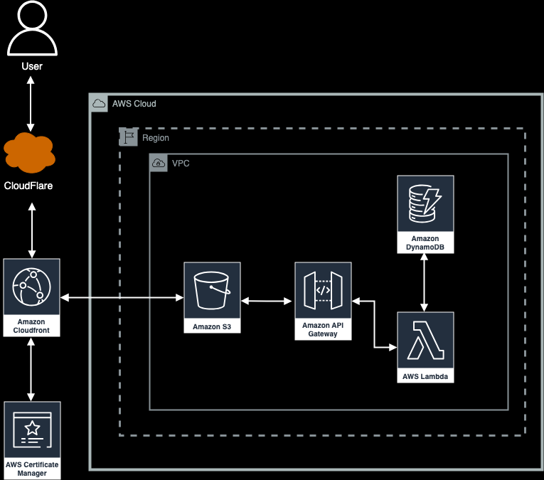

# Hungchih - AWS Resume

## About The Project

I'd like to express my gratitude to Naveen Raj and Rishab for their invaluable tutorials on the Cloud Resume Challenge. This project involves hosting a static website on an AWS S3 bucket with a visitor counter implemented using AWS Lambda functions. The website is built using HTML, CSS, and JavaScript.
 

## Demo

[View it live here](https://cloudresume.leechih.us/)

## Structure

- `.github/workflows/`: CI/CD workflow configurations.
- `frontend/`: Website files.
  - `index.html`: Frontend code.
  - `js/visitorcount.js`: JavaScript for visitor count.
- `infra/`: Infrastructure code.
  - `lambda/lambda_function.py`: AWS Lambda function for visitor counter.

## AWS Services Used

- Route 53
- CloudFront
- S3 bucket
- Certificate Manager
- Lambda function
- API Gateway
- DynamoDB

## Technical Issues and Solutions

### Issue: Using CloudFlare DNS Instead of Route53

**Issue:**
Due to not using Route53 as my DNS provider, I needed to configure CNAME records for my SSL certificate and CloudFront distribution.

**Solution:**

1. **SSL Certificate:**
   - Create a CNAME record in CloudFlare pointing to the AWS Certificate Manager (ACM) DNS validation record.
   - Verify and validate the SSL certificate through ACM using DNS validation.

2. **CloudFront Distribution:**
   - Set up a CNAME record in CloudFlare for the CloudFront distribution domain name.
   - Ensure the CNAME record points to the CloudFront distribution domain provided by AWS.
